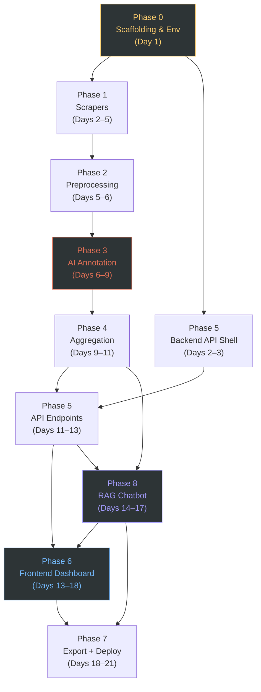

# 📋 Implementation Plan — Phase-Wise Build Guide

This document defines a step-by-step implementation plan for the Spotify AI-Powered Review Discovery Engine. Each phase is broken down into granular tasks, deliverables, estimated efforts, and exit criteria. The build order follows dependency logic where each phase outputs structures needed for subsequent stages.

---

## Table of Contents

1. [Implementation Overview](#1-implementation-overview)
2. [Phase 0 — Project Scaffolding & Environment Setup](#2-phase-0--project-scaffolding--environment-setup)
3. [Phase 1 — Data Collection (Scrapers)](#3-phase-1--data-collection-scrapers)
4. [Phase 2 — Preprocessing & Normalization](#4-phase-2--preprocessing--normalization)
5. [Phase 3 — AI Analysis & Annotation](#5-phase-3--ai-analysis--annotation)
6. [Phase 4 — Aggregation & Insight Generation](#6-phase-4--aggregation--insight-generation)
7. [Phase 5 — Backend API Layer](#7-phase-5--backend-api-layer)
8. [Phase 8 — RAG Chatbot Integration](#8-phase-8--rag-chatbot-integration)
9. [Phase 6 — Frontend Dashboard](#9-phase-6--frontend-dashboard)
10. [Phase 7 — Export, Deployment & Polish](#10-phase-7--export-deployment--polish)
11. [Timeline Summary](#11-timeline-summary)
12. [Risk Register](#12-risk-register)

---

## 1. Implementation Overview

### Build Order & Dependency Chain

### Guiding Principles

- **Build Depth-First:** Get a single source (e.g., Play Store reviews) working end-to-end (scrape $\rightarrow$ preprocess $\rightarrow$ annotate $\rightarrow$ aggregate $\rightarrow$ serve $\rightarrow$ render) before extending features across other sources.
- **Verify at Boundaries:** Every stage outputs structured JSON files to disk. Validate the schemas of these intermediate outputs before proceeding.
- **Progressive Integration:** Develop the frontend pages using static mock data payloads, swapping in live API requests as endpoints become verified.

---

## 2. Phase 0 — Project Scaffolding & Environment Setup

> **Goal:** Initialize the codebase scaffolding, local configuration loader, python/node dependencies, and data directories.

**Estimated Effort:** 1 day

### Tasks
- **0.1 Initialize Git & Tooling:** Create the workspace root with standard `.gitignore` settings excluding node modules, visual studio configs, python virtual environments, and scraped data directories (`data/`).
- **0.2 Scaffold Tree:** Setup the folder structures matching architectural standards: `backend/`, `frontend/`, `data/`, `scripts/`, `docs/`.
- **0.3 Configure Backend Environment:** Populate `backend/requirements.txt` with python dependencies: `fastapi`, `uvicorn`, `playwright`, `beautifulsoup4`, `chromadb`, `pydantic`, `reportlab`, `httpx`, `python-dotenv`. Initialize virtual env and run pip installs.
- **0.4 Install Automated Browsers:** Execute `playwright install chromium` inside the workspace to fetch optimized browser binaries.
- **0.5 Setup Frontend Setup:** Initialize Vite React on the frontend path using `npm create vite@latest ./ -- --template react`.
- **0.6 Frontend Dependencies:** Install packages: `react-router-dom@6`, `recharts`, `axios`, `zustand`, `@tanstack/react-table`, `tailwindcss`, `@tailwindcss/vite`.
- **0.7 Create Configuration Loader:** Write `backend/config.py` using `pydantic-settings` to define type-safe settings loading variables (`LLM_PROVIDER`, `CORS_ORIGINS`, `OLLAMA_BASE_URL`, `DATA_DIR`) dynamically from `.env`.
- **0.8 Initialize Storage Directories:** Setup data storage trees:
  `mkdir -p data/{raw/{play_store,app_store,reddit,spotify_community},preprocessed,analyzed,exports,errors}`
- **0.9 Configure Local LLM:** Verify local Ollama deployment. Run `ollama pull llama3.1:8b` and check reachability of `http://localhost:11434`.
- **0.10 Setup Logger & Utilities:** Implement `backend/utils/logger.py` (unified stdout and log-file output) and `backend/utils/file_io.py` (JSON/CSV handlers).

### Deliverables
- [ ] Repo scaffolding with standard structure and configured dependencies.
- [ ] Python backend virtual environment active with dependencies installed.
- [ ] React UI running and verified on `localhost:5173`.
- [ ] Local Ollama service pulled and answering requests.
- [ ] Configured logging and file reading/writing systems.

---

## 3. Phase 1 — Data Collection (Scrapers)

> **Goal:** Implement the Playwright automated scrapers to reliably gather user reviews and discussion feeds, persisting structured raw JSON formats.

**Estimated Effort:** 4 days  
**Dependencies:** Phase 0 complete

### Tasks
- **1.1 Build base scraper class:** `backend/scrapers/base_scraper.py` — Implement generic base structure featuring browser context creation, customized User-Agents, selenium evasion overrides, random jitter delays, exponential backoff retries, and deduplication prior to writing file outputs to `data/raw/<source>/YYYY-MM-DD.json`.
- **1.2 App Store Scraper:** Navigate through App Store RSS links or scroll browser page templates. Extract review author, rating bounds (1-5), clean bodies, date normalizations, and help counts. Target limit configurable via env.
- **1.3 Play Store Scraper:** Integrate `google-play-scraper` or custom Playwright scrolls on Play Store review panels. Parse dates, clean text bodies, and ratings.
- **1.4 Reddit Scraper:** Build scrapers navigating r/spotify or r/music threads using `old.reddit.com` or custom RSS feeds. Strip post elements, comment threads, upvotes, and date indexes.
- **1.5 Spotify Community Scraper:** Scrape community board categories. Parse topic headers, OP text, reply trees, and vote attributes. Filter against musical discovery terms.
- **1.6 CLI Runner Interface:** Implement `scripts/run_scrapers.py` CLI script providing command switches to selectively trigger scrapers (`--sources reddit,app_store --limit 100`).

### Deliverables
- [ ] Working `base_scraper.py` template.
- [ ] 4 scraper class scripts and CLI runner.
- [ ] Validated raw JSON files populated under `data/raw/<source>/*.json`.
- [ ] Anti-bot evasion systems verified (no HTTP 403 or captcha crashes).

---

## 4. Phase 2 — Preprocessing & Normalization

> **Goal:** Coordinate data cleansing, noise removal, deduplication algorithms, and cross-source aggregation.

**Estimated Effort:** 1.5 days  
**Dependencies:** Phase 1 complete

### Tasks
- **2.1 Double-pass Deduplication:**
  - *First Pass:* Compute exact Jaccard similarity (1.0) on tokenized prefixes (first 25 characters) to group and deduplicate duplicate comments. Keep the review with higher upvotes/help score.
  - *Second Pass:* Apply pairwise token similarity checking with a threshold of >0.85 Jaccard on reviews with bodies exceeding 50 characters. Skip evaluations if length differentials exceed 2x.
- **2.2 Text Cleansing & HTML stripping:** Standardize text content. Decode HTML entities and strip tag formats via BeautifulSoup. Collapse multiple white spaces and new lines.
- **2.3 Noise Filtering & Semantic Expansion:**
  - *Filters 1 (App Store & Play Store):* Remove emoji-only entries and entries with clean body length < 20 characters. Apply English language filter.
  - *Filters 2 (Reddit & Spotify Community):* Keep full discussion context by chunking each forum thread as one single cohesively indexed block.
  - *Keyword Density Expansion:* Take raw keywords provided by the user, run them through an LLM to generate domain-specific synonyms and antonyms, calculate a `keyword_density_score` for every review/thread, and sort the entire dataset descending to truncate noise.
- **2.4 Metadata Mapping:** Normalize date formats to YYYY-MM-DD. Extract standard engagement scores from varying source fields (`likes`, `upvotes`, `helpful_count`).
- **2.5 Source Merging:** Standardize IDs, resolve duplicates, and write a unified, clean database file to `data/preprocessed/all_reviews.json`.

### Deliverables
- [ ] `backend/analysis/preprocessor.py` coordinating the clean/dedup pipeline.
- [ ] Verified `data/preprocessed/all_reviews.json` file.
- [ ] Deduplication logs detailing raw counts, removed entries, and final dataset statistics.

---

## 5. Phase 3 — AI Analysis & Annotation

> **Goal:** Execute LLM inference loops to batch-process preprocessed reviews and generate 13 annotated insight fields.

**Estimated Effort:** 4 days  
**Dependencies:** Phase 2 complete, Ollama reachable

### Tasks
- **3.1 Build LLM Client:** `backend/analysis/llm_client.py` — Write interface supporting local Ollama (`llama3.1:8b`) and remote Groq API (`llama-3.1-8b-instant`) with automatic fallback to heuristics-based mock annotations if engines are offline. Support JSON mode configurations.
- **3.2 Construct Prompt 1 Template:** Maintain persona as Spotify Growth Analyst. Direct the LLM to structure outputs against the 6 core research questions and output a JSON array of analyzed reviews. Each review must split data into Review-Level fields (segment, intent) and a nested `themes` array containing Theme-Level fields (specific sentiments, barriers, unmet needs) for each distinct theme found.
- **3.3 Batch Processing Loop:** `backend/analysis/batch_analyzer.py` — Split dataset into chunks of 20. Track progress and log ETA. Implement resilient checkpoints where successful batches append immediately to disk.
- **3.4 Error Recovery Queue:** Catch malformed JSON responses, attempt correction prompts (max 3), and save failed batches to `data/errors/` for post-run recovery using the `--retry-failed` command.
- **3.5 Annotation Pipeline CLI:** Wire components into `scripts/run_analysis.py --stage annotate` to run the annotation phase.

### Deliverables
- [ ] `llm_client.py`, `prompts.py`, and `batch_analyzer.py`.
- [ ] Structured metadata dataset saved to `data/analyzed/reviews_analyzed.json`.
- [ ] Graceful retry hooks and recovery directory outputs in place.

---

## 6. Phase 4 — Aggregation & Insight Generation

> **Goal:** Compile review-level annotations into statistical portfolio-level insights answering the 6 key research questions.

**Estimated Effort:** 3 days  
**Dependencies:** Phase 3 complete

### Tasks
- **4.1 Theme Aggregation (Q1 & Q2):** Group annotations by `primary_theme`. Count frequencies, compute average sentiments, and calculate pain scores: `frequency * avg(abs(sentiment_score)) * source_count`. Extract top frustrations and unmet needs. Save to `themes.json`.
- **4.2 Intent Archetype Analysis (Q3):** Group by `intent_archetype`. Measure distribution, compute percentage of discovery reviews, and map representative user intent statements. Save to `behaviors.json`.
- **4.3 Repetitive Listening Analysis (Q4):** Group by `repetition_trigger` values. Compute trigger frequencies, correlate against user segments, and save output metrics to `repetition_causes.json`.
- **4.4 User Segment Profiling (Q5):** Group by `user_segment`. Profile segments by average sentiment, top friction themes, and primary barriers. Save to `segments.json`.
- **4.5 Unmet Need Opportunity Score (Q6):** Cluster similar `unmet_need` strings using SequenceMatcher ratio bounds ($\ge 0.70$). Rank needs by opportunity score: `frequency * unique_sources * avg(abs(sentiment_score))`. Save to `unmet_needs.json`.
- **4.6 Executive Summary Generation:** Compile overall dashboard statistics, source volume splits, average sentiment score, and top KPIs (e.g. top barrier, top trigger, most affected segment) into `summary.json`.

### Deliverables
- [ ] `backend/analysis/aggregator.py` script.
- [ ] 6 insight JSON files populated under `data/analyzed/` matching schemas.

---

## 7. Phase 5 — Backend API Layer

> **Goal:** Build the FastAPI REST API layer to serve aggregated insights, paginated reviews, background job triggers, and export files.

**Estimated Effort:** 3 days  
**Dependencies:** Phase 4 complete

### Tasks
- **5.1 Initialize FastAPI App:** Create `backend/main.py` configuring CORS origins, JSON encoders, and middleware setups.
- **5.2 Define Pydantic Schemas:** Set up strict typing schemas under `backend/models/` for input validation and serialized serialization outputs.
- **5.3 Serve Aggregated Views:** Build REST GET endpoints `/api/summary`, `/api/themes`, `/api/behaviors`, `/api/segments`, and `/api/unmet-needs` reading pre-computed JSON files.
- **5.4 Paginated Review browser:** Implement `/api/reviews` supporting parameters for sources, themes, sentiments, rating bounds, search strings, page indexes, and page sizes.
- **5.5 Background Jobs System:** Build POST `/api/scrape` (accepting JSON payload with `sources` array and `limit` integer) and `/api/analyze` running scraper and analysis scripts as subprocesses under isolated threads. Serve logs tailing via `/api/scrape/{job_id}`.
- **5.6 Export Endpoints:**
  - `GET /api/export/csv`: Stream filtered list of analyzed reviews as an attachment CSV.
  - `GET /api/export/pdf`: Accepts sections toggles, compiles overall statistics and visual breakdown tables via ReportLab, and downloads the PDF report.

### Deliverables
- [ ] `backend/main.py` entry point.
- [ ] Routers registered under `backend/routers/`.
- [ ] Verified Swagger UI interactive dashboard at `/docs`.

---

## 8. Phase 8 — RAG Chatbot Integration

> **Goal:** Ingest document datasets into ChromaDB namespaces and implement similarity retrieval chat logic.

**Estimated Effort:** 3 days  
**Dependencies:** Phase 4 and Phase 5 complete

### Tasks
- **8.1 Initialize Vector Store Client:** Write `backend/rag/vector_store.py` initializing Persistent ChromaDB clients under `backend/data/vectorstore`. Build embedding loader utilizing `nomic-embed-text` with fallback mock embedding functions.
- **8.2 Ingestion Pipeline script:** Implement `scripts/ingest_reviews.py` chunking and indexing records. Split ingestion collections:
  - **Memory 1:** Index App Store and Play Store reviews.
  - **Memory 2:** Index Reddit and Spotify Community threads.
- **8.3 Dual-Memory Retrieval Engine:** `backend/rag/retriever.py` — Run similarity queries against both collection namespaces in parallel (default K=15 each) applying pre-filtering on metadata fields. Prefix citations with tags (e.g. `[Review #1]` vs `[Discussion #3]`).
- **8.4 Chat Synthesis Service:** `backend/rag/chat_service.py` — Format Prompt 3 System instructions specifying guidelines (use only retrieved contexts, cite references next to claims). Call LLMClient API to synthesize the response.
- **8.5 Chat Router REST Endpoint:** Expose `POST /api/chat` router. Return synthesized chatbot outputs and citations array linking back to original data entries.

### Deliverables
- [ ] Working ChromaDB client and collection configurations.
- [ ] Ingestion script `ingest_reviews.py` verified.
- [ ] `/api/chat` endpoint returning grounded answers and structured source citations.

---

## 9. Phase 6 — Frontend Dashboard

> **Goal:** Build the React Single Page App UI utilizing Zustand state management, Recharts charts, and Axios API clients.

**Estimated Effort:** 5 days  
**Dependencies:** Phase 5 and Phase 8 active

### Tasks
- **9.1 Global Shell & Navigation:** Create layout components: `Sidebar.jsx` (routing triggers), `Header.jsx` (system metrics panel).
- **9.2 Axios API Client & Interceptors:** Define global Axios wrapper pointing to backend API servers.
- **9.3 Zustand Store Architecture:** Establish `useAppStore` global slice managing state slices for dashboard summaries, paginated tables, insights charts, filters, loading states, and job progression logs.
- **9.4 Build views:**
  - **Dashboard Page (`/`):** KPI cards, Recharts donut charts (source distribution), bar charts (top themes). Include a Pipeline Control panel to trigger Scrape & Analyze jobs, with an input field to specify the Scrape Limit (number of reviews/threads to fetch).
  - **Theme Explorer Page (`/themes`):** Treemaps, heatmaps, and details panel showing frustrations and unmet needs per theme.
  - **Reviews Browser Page (`/reviews`):** Paginated review lists with custom filter sidebar panels and modal popup review detail overlays.
  - **Segments Page (`/segments`):** Side-by-side user type comparison dashboard cards.
  - **Chatbot Page (`/chat`):** Bubble chat message interfaces featuring quick suggestion prompt chips, citation overlays, and typing status banners.
  - **Export Page (`/export`):** ReportLab PDF compilation checkboxes and CSV download controllers.

### Deliverables
- [ ] Navigable React Single Page Application.
- [ ] Zustand store hooks wired.
- [ ] All pages communicating with API servers.
- [ ] Charts rendering responsive layouts.

---

## 10. Phase 7 — Export, Deployment & Polish

> **Goal:** Finalize PDF styling configurations, execute backend test coverage suites, setup CI/CD pipelines, and deploy frontend and backend to production.

**Estimated Effort:** 3 days  
**Dependencies:** Phase 5 and 6 complete

### Tasks
- **10.1 PDF layout styling:** Polish ReportLab rendering rules. Style headers, footers, page indexes, visual chart tables, and quote segments.
- **10.2 Write Backend Tests:** Write python test files under `backend/tests/` verifying preprocessor dedup algorithms, aggregator calculations, and router API response codes using pytest.
- **10.3 Setup Docker Compose:** Write local orchestration configs mapping persistent local data directories.
- **10.4 Deploy Backend:** Deploy FastAPI to Render. Integrate sidecar services fetching the pulled Ollama models. Configure Render environment parameters (`CORS_ORIGINS`, `DATA_DIR`).
- **10.5 Deploy Frontend:** Deploy the React static build folder to Vercel. Bind base API endpoint URLs to Render server addresses.
- **10.6 Implement CI/CD Actions:** Setup Actions workflows checking code test suites, building builds, and deploying main branches.
- **10.7 E2E Smoke testing:** Execute full user flows from ingestion to PDF export on production URLs.

### Deliverables
- [ ] Polished, production ReportLab PDF exports.
- [ ] Pytest testing suite passing with coverage details.
- [ ] Backend active on Render; Frontend live on Vercel.
- [ ] Working Docker Compose configuration.
- [ ] Active automated CI/CD actions.

---

## 11. Timeline Summary

| Phase | Build Phase Module | Estimated Effort | Cumulative Timeline |
|---|---|---|---|
| **Phase 0** | Project Scaffolding & Environment Setup | 1 day | Day 1 |
| **Phase 1** | Data Collection (Scrapers) | 4 days | Days 2–5 |
| **Phase 2** | Preprocessing & Normalization | 1.5 days | Days 5–6 |
| **Phase 3** | AI Analysis & Annotation | 4 days | Days 6–9 |
| **Phase 4** | Aggregation & Insight Generation | 3 days | Days 9–11 |
| **Phase 5** | Backend API Layer | 3 days | Days 11–13 |
| **Phase 8** | RAG Chatbot Integration | 3 days | Days 14–17 |
| **Phase 6** | Frontend Dashboard | 5 days | Days 13–18 |
| **Phase 7** | Export, Deployment & Polish | 3 days | Days 18–21 |
| | **Project Build Timeline** | **~24 working days** | |

---

## 12. Risk Register

| Risk Event | Severity | Likelihood | Mitigation Strategy |
|---|---|---|---|
| **R-1: Scraper DOM Selector changes** | High | Medium | Isolate scraper parsing helpers. Monitor scraped content lengths. |
| **R-2: Scraper IP rate limits** | High | Medium | Integrate stealth evasion plugins. Rotate headers. Run jobs during off-peak windows. |
| **R-3: LLM parser output formats** | Medium | Medium | Validate enums. Implement parsing retry catch handlers correcting JSON blocks. |
| **R-4: Local LLM speeds** | Low | High | Use smaller model variants (`llama3.1:8b`). Stream batch states showing current progress. |
| **R-5: Render free tier memory constraints** | High | Medium | Deploy using entry-level paid servers. Optimize thread processes. |
| **R-6: Over-aggressive deduplication** | Low | Low | Keep deduplication parameters conservative ($0.85$ Jaccard threshold). Save deduplicated counts. |
| **R-7: RAG query speeds** | Medium | Medium | Adjust retrieval limits. Ensure index fields are cleanly partitioned. |
| **R-8: LLM citation formatting errors** | Low | Medium | Utilize explicit instruction parameters. Post-process response tags. |

---

*This document is a living project guide. Updates to task milestones or timeline windows should be revised in alignment with [architecture.md](file:///Users/ankurabhijeet/Documents/nextleap/projects/Spotify_review_scraper/docs/architecture.md).*
